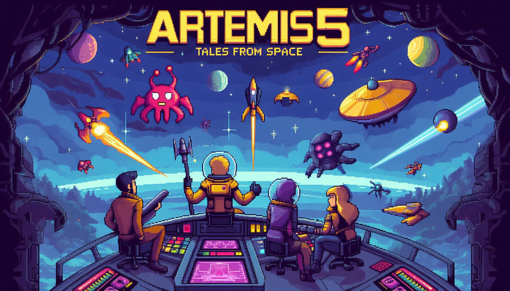

    

# Artemis5: Tales From Space
A projekt a Modern szoftverfejlesztési eszközök (GKNB_INTM006) című tantárgyunk félévi feladataként készül.

A játék hasonló a Space Invaders című klasszikushoz. A játékosnak egy űrhajót irányítva kell legyőznie ellenfeleit és teljesítenie a rá bízott küldetést.

Fejlesztők
-------
- Barszcz Dániel
- Fekete Tamás
- Rázmán Balázs
- Szakál Gyula Richárd
- Szalay Szabolcs

Források
-------
🚀 Játékos űrhajójának textúrái: 
<a href="https://foozlecc.itch.io/void-main-ship?fbclid=IwZXh0bgNhZW0CMTAAAR2BWJ98u22L-48XuZsH6plVusGlo-wJ6TjeG0-Lm4PxKJ_gA39OFmUIyXU_aem_kOyKo269Dk8lL8RSsubbJA"> Main Ship by Foozle</a>

👾 Ellenséges űrhajók, lövedék textúrái: 
<a href="https://assetstore.unity.com/packages/2d/characters/warped-space-shooter-181590">Warped Space Shooter</a>

💬 Betűkészlet: <a href="https://fontstruct.com/fontstructions/show/908795/pixel_unicode"> Pixel Unicode</a>

🌎  Minden, itt fel nem sorolt egyéb asset saját szerkesztésű, vagy a <a href="https://designer.microsoft.com/">Microsoft Designer</a> mesterséges intelligencia használatával készült.